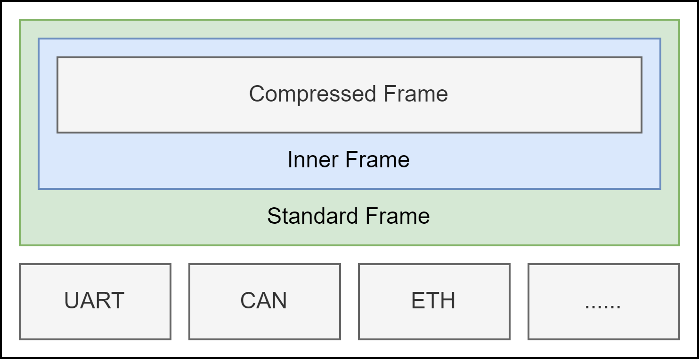

# RovLink

为嵌入式设计的可扩展序列化传输协议，为标准水下机器人通信提供可靠支撑

## 概述

本协议（RovLink）是供各类嵌入式设备（包括但不限于水下机器人）使用的**可扩展**、**跨语言**、**控制层解耦**指令集与数据序列化协议，规定了设备内外多处理器数据传输和存储格式。

* 本协议旨在**为机器人提供统一的智能控制指令和反馈数据传输格式**
* 本协议旨在**为数据提供可靠高效的二进制存储格式**
* 本协议旨在**为用户提供扩展性、兼容性良好的使用体验**

本仓库包含 RovLink 协议的说明文档 `doc` 、示例代码 `example` 、基础指令分类 `isa` 、旧版协议存档 `legacy` 、示例软件 `tools` 等

协议规定了三个层次：

* 物理层：协议能够支持的数据总线标准
* 传输层：协议在上位机、下位机内部进行传输时的路由标准
* 应用层：下位机数据和上位机控制指令的具体存储和传输方式

RovLink 底层数据传输（物理层）是由具体总线协议完成的

## 物理层

* 在当前标准下，RovLink 可以使用如下通用板级总线传输：

    * 标准TTL（3.3V/5V）串口
    * 标准RS232串口

* 在当前标准下，RovLink 可以使用如下现场总线传输：

    * 标准RS485串口
    * 标准RS422串口
    * CAN总线
    * 百兆/千兆ETH以太网

* 在当前标准下，RovLink 可以使用如下片上总线传输：

    * AMBA4 AXI4-Full/Lite
    * AHB4-Full/Lite
    * APB4

RovLink 允许基于硬件（FPGA 或 CPLD）的协议栈实现

## 传输层

RovLink 具有两种基本帧格式

* **标准帧** `StandardDataFrame`：**上位机和机器人主控之间必须使用标准帧传输**，机器人内部可以选择传输标准帧或内部帧
* **内部帧** `InnerDataFrame`：**机器人内部使用CAN总线互联时，只能使用内部帧**，其他情况下，可选使用标准帧

> 到目前为止，两种帧的差别只有帧头识别码和帧尾校验码

RovLink 还支持32位的**压缩指令帧** `RovLinkComp`

在互联中，可根据帧特征码（特征指示-设备ID）进行舱间路由，协议最多可支持 `15` 个设备间的互联

## 应用层

用户可以使用协议生成器 **Bubbler** 提供的模板生成多种语言的编解码 API，功能包括：

* 标准帧、内部帧打包
* 标准帧、内部帧解包
* 标准帧-内部帧转换
* Payload解析和编码
* 帧特征码识别

> 目前未完全实现的功能包括：
>
> * 指令压缩和译码
> * 标准帧、内部帧扩展

RovLink 还预留了三个指令子集 C、D、E 供用户定义自己的 RovLink 帧。

## 历史版本

本指令集迭代自旧版控制指令，旧版内容可参考 `Legacy` 目录下的 `ControlFormat_Legacy.xlsx` 和 `DataFormat_Legacy.xlsx`