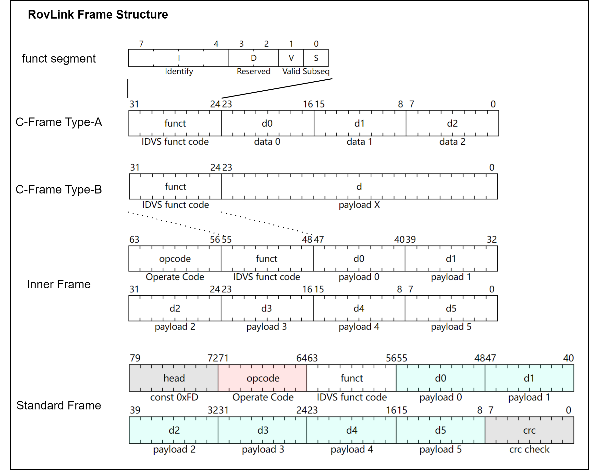

# RovLink 压缩指令帧

RovLink 支持 32 位（总长度4字节）的**压缩指令帧**，在片上总线（如 AXI-Lite）和高速模拟总线（如 LVDS）上，RovLink 可以通过压缩指令帧完成单周期数据交换。

> [!NOTE]
>
> 本文档介绍压缩指令帧的格式和基本要求

## RovLink 压缩帧指令格式

> 压缩帧由 RovLink 内部帧进一步处理得到。它将内部帧的数据类型缩短为6bit，并修改特征指示为2bit，从而支持片上总线/协处理器应用。

压缩帧分成两种基本格式，分别用于与片外数据交互和直接控制数据，称为 **Type-A** 和 **Type-B**。压缩指令帧的基础格式与内部帧几乎一致，但其中 8bit 长度的**特征指示**段（funct 字段）功能与标准指令帧中的 funct 字段不同。

funct 字段的组织格式如下表所示

| 比特位数 | 字段名称               | 字段描述            |
| -------- | ---------------------- | ------------------- |
| 1        | Identify type（It）    | 设备ID-数据类型标志 |
| 2        | Identify dest（Id）    | 设备ID-目标地址标志 |
| 3        | Identify dest（Id）    | 设备ID-目标地址标志 |
| 4        | Identify dest（Id）    | 设备ID-目标地址标志 |
| 5        | Reserved（Dbit）       | 保留字段            |
| 6        | Reserved（Dbit）       | 保留字段            |
| 7        | Reserved Valid（Vbit） | 保留检验有效位      |
| 8        | Subseq（Sbit）         | 后继有效位          |

其中，Dbit、Vbit、Sbit 的功能与 RovLink 内部帧完全一致，但Ibit被分成了两个子段：

* **It**：用于区分当前压缩帧的设备ID
* **Id**：用于确定当前压缩帧要发送的设备目标地址

### 压缩帧 Type-B

当 **It=0** 时，压缩帧的 funct 可与内部帧一一对应，此时压缩帧成为 **Type-B** 格式。

在该情况下，Id 能够唯一寻址的目标如下表所示

| Id[2:0]取值 | 寻址目标 | 说明                             |
| ----------- | -------- | -------------------------------- |
| 3'b000      | 预留     | 预留地址                         |
| 3'b001      | 动力ID   | 与内部帧指定的动力板卡唯一对应   |
| 3'b010      | 控制ID   | 与内部帧指定的控制板卡唯一对应   |
| 3'b011      | 通讯ID   | 与内部帧指定的通讯板卡唯一对应   |
| 3'b100      | 主控ID   | 与内部帧指定的主控板卡唯一对应   |
| 3'b101      | 上位机ID | 与内部帧指定的上位机板卡唯一对应 |
| 3'b110      | 预留     | 预留地址                         |
| 3'b111      | 预留     | 预留地址                         |

在 Type-B 中，RovLink 能够与片外设备进行交互通信。

整个 Type-B 的压缩帧格式如下表

| 比特数 | 字段类型    | 字段名称 | 字段描述   |
| ------ | ----------- | -------- | ---------- |
| 8      | uint8_t     | funct    | 特征指示头 |
| 24     | 3 * uint8_t | payload  | 保留数据包 |

在该帧下，为了与片外设备通过 RovLink 协议通信，payload 字段将被按需求预先填充数据，等待传输层或物理层对其进行 head、opcode、crc、剩余 payload 部分的填充，得到一个完整的内部帧或标准帧。因此，可以将压缩帧 Type-B 视为 RovLink 协议的应用层报文。

### 压缩帧 Type-A

当 **It=1** 时，压缩帧的 funct-Id 用于表述特殊的帧语义，此时 Id 等效为内部帧中的 opcode，此时压缩帧成为 **Type-A** 格式。

在该情况下，Id 能够表示的指令操作码如下表所示

| Id[2:0]取值 | 指令操作码 | 说明       |
| ----------- | ---------- | ---------- |
| 3'b000      | nop        | 空指令     |
| 3'b001      | wrb        | 按字节写入 |
| 3'b010      | rdb        | 按字节读取 |
| 3'b011      | wrx        | 连续写入   |
| 3'b100      | rdx        | 连续读取   |
| 3'b101      | rda        | 地址读取   |
| 3'b110      | mod        | 模式切换   |
| 3'b111      | rst        | 软件复位   |

各种指令操作码下，压缩帧 Type-A 的 payload 字段可按两种形式出现：

* 3 段 INT8/UINT8 立即数：本帧无地址地传输 3 段不同语义的数据
* 1 段 INT16/UINT16 立即数与 1 段 INT8/UINT8 地址位：本段向某一地址传输 1 段数据

## RovLink 片上突发传输

RovLink 通过后继有效位实现了突发传输功能，具体传输方式与标准协议一致，但可以通过并行总线传输。在并行总线传输 RovLink 时，*协议允许用户调用 funct 字段的预留位扩展实现 valid-ready 握手协议*。

## 支持 RovLink 的片上设备

如果一个片上设备或接口支持RovLink，它应当在内部维护一个8KB以下容量的共享内存（Shared Memory）或内存映射IO寄存器（Memory Mapped IO Register），从而让主机CPU通过压缩帧B完成读写操作。

压缩帧A通常用于向RovLink片上设备直接写入数据，从而完成模式修改、运行微调等工作。

## RovLink 示例

当前版本中，RovLink 将不会对压缩帧提供任何示例，后续开发工作中将根据应用情况为其配备专用的编解码器和总线桥。
