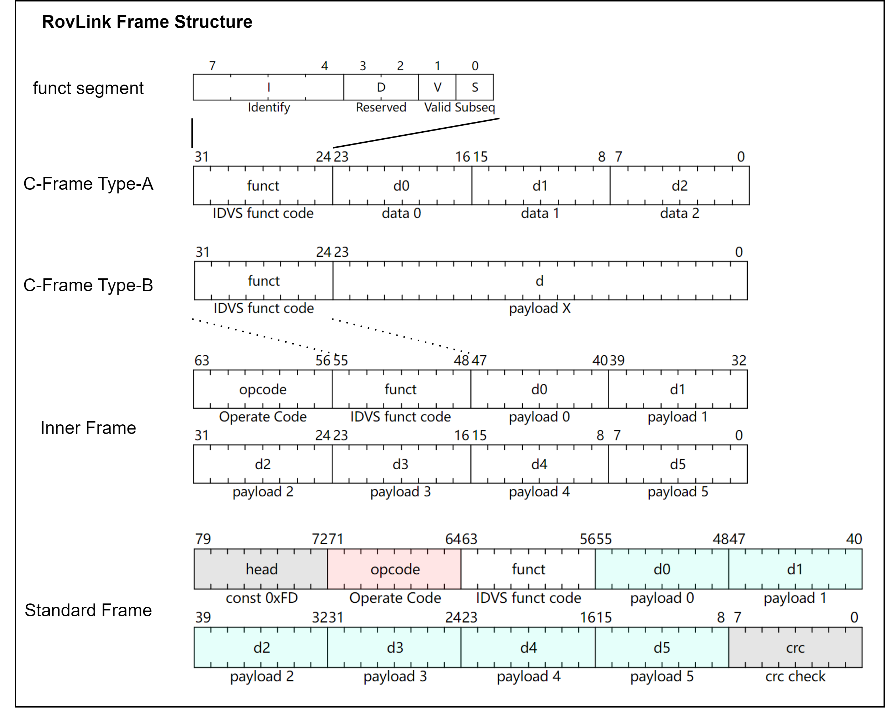

# 协议规范 Protocol Specification

> [!NOTE]
>
> 本文档介绍了RovLink的消息帧结构、路由方式、通讯方式定义。

RovLink本质上是一种消息结构，可以建立在不同总线/传输协议物理层上。RovLink主要针对水下机器人的上位机（CoralReef-X）和下位机（FinNAV based ROV/AUV/UUV）通讯场景设计。

为了方便不同性能的设备使用，RovLink采用了**定长**帧结构，并设计了2种基本帧格式和1种压缩帧格式，保障协议可以在串行板级总线或并行片上总线物理层上完成传输。

针对本文档中的内容可视化，读者可以自行参考附录 `isa` 中的 `Excel` 表格

## RovLink 帧结构

一条 RovLink 消息被称为一个 **RovLink 帧**（**Frame**）

RovLink 帧结构可以分成两种：

* **标准帧** `StandardDataFrame`：**上位机和机器人主控之间必须使用标准帧传输**
* **内部帧** `InnerDataFrame`：**机器人内部使用CAN总线或片上总线物理层互联时，只能使用内部帧**

> 机器人内部各个组件之间的通讯可以自行选择传输标准帧或内部帧

此外，RovLink 规定了一种专用于片上总线物理层互联的压缩帧格式：

* **压缩帧** `CompressedDataFrame` ：**机器人内部使用片上总线物理层互联时，推荐使用压缩帧**

RovLink 可传输的数据长度被限定在 6 Bytes，这已经能够完成大多数控制指令和小规模数据的传输。特别地，RovLink支持以**突发传输**（**Burst Transmission**）的方式传输更大规模数据，具体内容参考 [RovLink突发传输](##RovLink突发传输)。

### 标准帧结构定义

一个 RovLink 标准帧包含 **10 个字节**数据。

| 字节数 | 字段类型    | 字段名称 | 字段描述                              |
| ------ | ----------- | -------- | ------------------------------------- |
| 1      | uint8_t     | head     | 帧头标志位，恒为 `0xFD`               |
| 2      | uint8_t     | opcode   | 数据类型（操作码）                    |
| 3      | uint8_t     | funct    | 特征指示                              |
| 4-9    | 6 * uint8_t | payload  | 数据包                                |
| 10     | uint8_t     | crc      | 帧尾校验位，前9个字节作CRC32后取低8位 |

帧头 **head** 恒为一个字节（8 bit）的起始位 `0xFD` 。

数据类型（操作码） **opcode** 由一个对照表指定，对照表中每个不同的值代表一种数据类型，本段也是 8 位。从语义上进一步划分，opcode 高四位表明本帧对应的指令子集，低四位决定本帧的具体数据类型。更多信息可以参考 [ISA说明文档](./RovLink_ISA.md)。

> [!IMPORTANT]
>
> **Opcode决定了一个帧数据的语义信息**

特征指示 **funct** 由四个子字段构成，如下表所示，因此它可以被概括为术语 “IDVS”

| 比特位数 | 字段名称         | 字段描述   |
| -------- | ---------------- | ---------- |
| 1        | Identify（Ibit） | 设备ID     |
| 2        | Identify（Ibit） | 设备ID     |
| 3        | Identify（Ibit） | 设备ID     |
| 4        | Identify（Ibit） | 设备ID     |
| 5        | Reserved（Dbit） | 保留字段   |
| 6        | Reserved（Dbit） | 保留字段   |
| 7        | Valid（Vbit）    | 检验有效位 |
| 8        | Subseq（Sbit）   | 后继有效位 |

**设备ID**（Identify），简写为 **Ibit** 或 **ID** ，用来指示发送本帧的**源设备**（Source Device）。RovLink 中间设备（Route Device）根据本段的指示来完成数据路由功能。Ibits 长度为 4 位（4 bits），可供使用的路由地址从 `0x0` 到 `0xF` 共16个，因此 RovLink 可以提供 15 个设备的路由。

> 以下内容已经被从最新的RovLink协议中移除，因为 DLC 的设定过于繁琐且不常用，将该字段删除
>
> **数据长度码**（Data Length Code），简写为**DLC**，用来指示本帧数据应当如何解算，根据不同取值可分为如下四种情况：
>
> * `2'b00`：多个数据，后续的数据Payload部分存储6个uint8_t格式的数据
>
>     > 常用于上位机控制下位机进行模式切换，或控制一些以开关量（0/1）描述的外设，也可用于上传较多具有小数值的传感器数据
>     >
>     > 在用户扩展指令子集中，DLC=2'b00情况下，允许用户使用后续6*8=48bit传输更多开关量
>
> * `2'b01`：大数或突发模式，后续的数据Payload部分存储1个uint32_t格式的数据；或存储了1个uint48_t格式的数据；或存储突发模式标志用来控制RovLink突发传输
>
>     > 常用于突发传输的控制，详见后续RovLink突发传输部分；也用于某些特殊大数据的传输
>
> * `2'b10`：2个数据，后续的数据Payload部分存储1个uint32_t格式的数据和一个uint16_t格式的数据
>
>     > 常用于对下位机某些算法关键参数的修改，uint32_t格式数据常常以32位浮点数（fp32）格式读取，uint16_t则用于指定要修改算法的哪一个参数（算法对象标志位）。特别地，[*RovLink心跳包*](###心跳包)采用这种DLC
>
> * `2'b11`：3个数据，后续的数据Payload部分存储3个uint16_t格式的数据
>
>     > 常用于一般的外设控制和传感器数据上传
>
> RovLink通过DLC控制Payload解码的方式来扩展一个Opcode的兼容性：具有相同Opcode的帧根据DLC不同可以衍生出4种解析方法，从而让相同Opcode的帧能够承载语义相同但数量不同的数据

**保留字段**（Reserved），由于旧协议兼容可简写为 **Dbit**，长度为 2 位（2 bits），保留功能。

**检验有效位**（Valid），简写为 **Vbit**，长度为 1 位（1 bit），用来控制本帧是否使用帧尾校验位。如果该位为 1'b0，那么帧尾校验位会被忽略；如果该位为 1'b1，那么需要使用程序预设的校验算法对数据 Payload 部分进行校验，并与帧尾校验位进行对比，如果不一致则舍弃该帧数据。

**后继有效位**（Subsequent），简写为 **Sbit**，长度为 1 位（1 bit）。该位用于说明本帧是否具有后继帧，如果该位是1，表示本帧具有后续数据；如果该位为0，表示本帧后没有后续数据，是一个独立的帧，或是突发传输的结束帧。

> 有关后继有效位的作用描述见[RovLink帧特性](##RovLink帧特性)和[RovLink突发传输](##RovLink突发传输)

数据包 **Payload** 包含 6 个字节（6 Bytes），用于搭载 RovLink 帧要传递的指令或数据。这些数据使用下面的几种数据格式被保存到帧中：

* int8_t/uint8_t：数据被以 8 位无符号整型的方式存储，在接收端按语义复原
* int16_t/uint16_t：数据被以 16 位无符号整型的方式存储，在接收端按语义复原
* int32_t/uint32_t：数据被以 32 位无符号整型的方式存储，在接收端按语义复原
* int48_t/uint48_t：数据被以 48 位无符号整型的方式存储，在接收端按语义复原

> int48_t/uint48_t 是 RovLink 为满足 48 位 Payload 对齐提出的一种存储格式，通过对 int64_t/uint64_t 按比例缩放得到对应 48 位长度的数据，并进行四舍五入后得到 int48_t/uint48_t 格式的数据

一般地，FP32 格式（依据 IEEE754 规范）的数据直接保存到帧中进行传输，读取时再以float_t的形式进行读取，从而保证传输中的无精度损失；RovLink **不支持** FP64 格式的数据传输，因此FP64需要事先进行量化。同样地，UINT64 或 INT64 格式数据可以量化到符合 uint48_t 或 int48_t 的数据大小后再以 uint48_t 的数据格式保存到帧中传输，存在量化误差。对于常见数据类型，采用下表给出的方式保存到数据包。

| 数据类型     | 长度（bits） | 默认保存方式                                              | 可选保存方式                   |
| ------------ | ------------ | --------------------------------------------------------- | ------------------------------ |
| FP64         | 64           | 不支持                                                    | 量化至 FP32 规格后传输         |
| FP32         | 32           | 直接按照 IEEE754 格式存储                                 |                                |
| INT64/UINT64 | 64           | 不支持                                                    | 量化至 INT48/UINT48 规格后传输 |
| INT32/UINT32 | 32           | 存储在 payload[3:0]，可存储 1 个值                        |                                |
| INT16/UINT16 | 16           | 存储在 payload[1:0], [3:2], [5:3]，可存储 3 个值          |                                |
| INT8/UINT8   | 8            | 存储在 payload[0], [1], [2], [3], [4], [5]，可存储 6 个值 |                                |

> 在读写单精度浮点数时，程序应当遵循IEEE754规范，或交给编译器自动处理。

Payload以**高字节序**存储，待发送数据的高字节存储在 `Payload[0]` 处。

> [!TIP]
>
> 允许使用自定义的*突发传输*来逐帧传递48位以上长度的数据

帧尾校验位 **CRC** 是一个字节大小的校验位。如果 funct（IDVS）中 Vbit=0，那么该位在传输过程中可以被忽略；如果 funct 中 Vbit=1，设备必须以 **CRC32** 校验算法对 payload 字段进行校验，取输出值的低 8 位保存到该字段中。每一个中间设备都需要进行一次校验并与该位对比，若不一致则将对应的帧丢弃。

### 内部帧结构定义

一个RovLink内部帧包含 **8 个字节**的数据，这使得它能够方便地通过CAN总线等64位对齐的总线物理层进行传输。其帧结构定义如下表

| 字节数 | 字段类型    | 字段名称 | 字段描述           |
| ------ | ----------- | -------- | ------------------ |
| 1      | uint8_t     | opcode   | 数据类型（操作码） |
| 2      | uint8_t     | funct    | 特征指示           |
| 3-8    | 6 * uint8_t | payload  | 特征指示数据包     |

内部帧是标准帧的简化版，**去除帧头和帧尾**。因为不包含帧头，传输内部帧需要物理层/传输层的起始帧检测支持；抑或是要求设备降低传输速率，避免出现数据覆盖的情况，这将交由开发者自行决定。由于不包含帧尾，传输内部帧需要物理层/传输层的数据校验支持，同时 funct 字段中的 Valid 子字段也将失效，传输中不再关心该位的情况，因此实质上的 funct 字段被划分为下表所示

| 比特位数 | 字段名称               | 字段描述       |
| -------- | ---------------------- | -------------- |
| 1        | Identify（Ibit）       | 设备ID         |
| 2        | Identify（Ibit）       | 设备ID         |
| 3        | Identify（Ibit）       | 设备ID         |
| 4        | Identify（Ibit）       | 设备ID         |
| 5        | Reserved（Dbit）       | 保留字段       |
| 6        | Reserved（Dbit）       | 保留字段       |
| 7        | Reserved Valid（Vbit） | 保留检验有效位 |
| 8        | Subseq（Sbit）         | 后继有效位     |

内部帧的其他内容和标准帧完全一致

### 压缩指令帧

用户可参考 [RovLink压缩指令帧规范文档](./RovLink_Compress.md) 获取更多信息

### 消息种类对照表 Opcode LUT

可供使用的预定义的 opcode 查找表如附录 `isa` 中的 `Excel` 表格；也可以参考 RovLink 的 [ISA规范文档](./RovLink_ISA.md)。表格的每行代表高四位指令子集的值，每列代表低四位具体数据类型的值，二者相或（OR）即可得到Opcode的对应值。

### RovLink 帧结构总览

## RovLink 广播

在机器人中，我们常常需要较多SoC板间互联，因此要求指令能从上位机准确发送到目标SoC；同样，需要回报的传感器数据从下位机以稳定的频率回传给上位机；很多时候也需要下位机内部的智能控制设备暂时替代上位机向目标MCU发送控制指令和接收来自其他设备的传感器数据。RovLink基于路由功能满足该需求。

支持RovLink的每个设备都需要定义自己的 ID，这被称为**设备ID**（Device ID，**DID**）；同时需要定义自己需要接收（Peek）数据的 opcode，这些 opcode 组合成**截留数据类型列表**（Opcode Peek List，**OPL**）；还需要定义自己允许接收数据的来源，也就是允许的源设备ID，这被称为**白名单**（White List，**WL**）

下面给出基本定义。

* **源设备**

    当设备A向其他设备发送RovLink帧时，设备A就被称为这一帧的源设备（Source Device，**SD**），*其DID需要被写入帧的Ibits段*

* **目标设备**

    需要使用到来自某个源设备的RovLink帧的设备被称为目标设备（Destination Device，**DD**），目标设备按照预先定义的OPL和WL接收来自指定源设备的指定类型帧数据

* **中间设备**

    如果源设备的RovLink帧以一对一总线的形式发出，且与源设备相连的设备并不是目标设备，那么这个设备就称为中间设备（Route Device，**RD**）。

RD 会根据自己预先定义的 OPL 和 WL 来接收帧数据，但对于非WL的其他所有设备发来的帧，都会执行**路由**（Route），在不解包出 Payload 的情况下将帧数据发送到更接近目标设备的总线上。

有些数据需要被多个 RD 接收和处理，这些数据需要被预定义在这些 RD 的 OPL 和 WL 中，RD 在接收到数据后继续执行路由转发

需要指出：*在使用互联总线（如CAN）的时候，不存在中间设备，来自SD的帧能够直接发送到DD*，这种情况下，使用内部帧不需要支持 RovLink 路由

### 一些规定

* **上位机是源设备，同时也是目标设备**
* **当且仅当上位机作为转发服务器（CoralReef Server Mode）时，允许作为中间设备**
* **负责控制推进器的MCU或SoC不允许作为中间设备，但可作为源设备和目标设备**

## RovLink 帧特性

RovLink支持水下机器人最常使用的几种数据传输，包括控制指令、传感器回传数据、机器人当前状态、心跳包、特殊功能帧。这些类型的数据不会被帧中任何一位数据指定，**仅取决于Opcode所说明的数据类型**。具有特定功能的RovLink帧如下所示

### 指令帧

指令帧是 Payload 中包含了控制指令的帧。控制台通过向机器人发送一条指令帧来让机器人完成某项工作或达到某种状态。

### 回传帧

回传帧是 Payload 中包含了传感器回传数据的帧。机器人会按照固定的频率向控制台发送已定义的回传帧。

### 状态帧

状态帧是 Payload 中包含了机器人当前状态回传数据的帧。状态帧与回传帧不同的地方在于：只有当控制台（帧 DID 为 `0x05` 的情况）向机器人发送一条空白状态帧时，机器人才能够向控制台（源设备）返回一条 opcode 相同且包含状态数据 payload 的状态帧

### 心跳包

心跳包是一种特殊的帧，上位机和下位机之间必须以“握手”形式以恒定间隔互相发送心跳包。**如果下位机超过5s没有接收到上位机发送的心跳包，视为心跳包超时，应当将机器人置为休眠状态。**

规定**心跳包必须由上位机先向下位机发送**，payload 包含 uint32_t 格式的 UNIX 时间戳，要求发送间隔小于 1s；下位机接收到心跳包后，立即向上位机返回一帧心跳包，不对回传心跳包的 payload 作要求，但推荐设置为当前的 UNIX 时间戳或 RTOS 系统时钟截取低 32 位，统一格式化为 uint32_t

**休眠状态**下，要求机器人推进器停转或保持低速上浮、机器人外部动作停止，所有舵机复位到默认状态，机械手或机械臂保持上次接收到心跳包时刻之前的状态，其他对环境存在干扰的外设全部关闭，灯光置为高亮或闪烁状态，便于搜救打捞团队能够快速定位机器人，防止机器人对外界人员或环境造成伤害。如果机器人开启黑匣子功能，休眠后应当优先将设备传感器数据记录到存储设备。

### 功能帧

功能帧是用于RovLink自身功能触发的特殊帧。突发传输需要使用功能帧实现传输开始、停止和重连。**允许功能帧中包含指针来在软件系统内通过 RovLink 传递复杂数据包，从而兼容其他协议或切换到厂测模式**。

## RovLink 突发传输

RovLink 是定长的传输协议，但允许通过**突发传输**（**Burst Transaction**）的方式传输较长的数据。RovLink 主要依赖后继有效位（**Sbit**）区分突发传输和独立单帧传输。在不启用突发传输时，RovLink 默认不区分先后顺序，支持乱序收发；但在突发传输中，要求按照 opcode 规定的方式按序发送数据。

### 突发传输形式

由于 RovLink 的每一帧都限制最多携带 6 个字节的数据，更长的数据只能通过多帧传输。在开启突发传输后，源设备向总线连续发送数个功能帧形式的 RovLink 帧，每一帧中都携带了 6 个字节的数据，直到将待发送的所有数据传输完毕。

突发传输过程中所有帧都使用功能帧形式，采取标准帧 funct 部分的 Sbit 作为起始和结束的标志：突发传输总是以一个 Sbit=1（即该帧有后继帧）的 RovLink 帧作为开始标志，称为**起始帧**。目标设备在接收到起始帧后，需要等待后继功能帧，这些承载数据的功能帧都具有 Sbit=1 的特征。数据传输末尾，最后一个数据包的 Sbit=0（该帧没有后继帧）作为结束标志，该帧称为**结束帧**，目标设备在接收到结束帧后处理接收到的数据，避免在处理过程中丢失数据。RovLink 的突发传输功能默认传输层具备错误校验的能力，因此不再额外提供帧发送校验和接收校验字段。突发传输采用**高字节序**格式，按 6 字节对齐，待传输数据的高 6 字节会被首先传送（与 payload 一致）。

在源设备发送起始帧后，应当保留至少 10ms 的空闲时间，该区间内，目标设备需要完成对设备的调整以应对突发传输中的连续接收和可能的握手需求。

由于 RovLink 采用 6 字节对齐，很可能出现末尾字节无法正好填充满整个帧的情况，此时要求**在空白字节填充0xFF**。比如传输 28 个字节，通过 4 帧传输完高 24 字节后，还剩余末尾 4 字节需要传输，这时将末尾 4 字节填充到 payload 部分的 [0]~[3] 字节，第 [4] 和 [5] 字节填充为 0xFF

突发传输的整体步骤如下：

1. 源设备向目标设备发送起始帧 
2. 源设备等待10ms，目标设备切换工作状态
3. 源设备向目标设备连续发送多帧
4. 源设备向目标设备发送结束帧
5. 目标设备对数据进行后处理

### 握手协议

**突发传输中，握手协议被作为一个可选项，允许开发者自行设置**。目标设备在接收到每一帧后都可以通过帧尾的校验位对帧数据进行检验，并向源设备发送一个带有当前帧计数的**确认帧**。如果源设备在发送完一帧数据后一定时间内没有接收到确认帧，或确认帧内标记的当前帧数目与源设备已发送的数据帧数目存在偏差，则需要重发该帧

带有握手协议的突发传输的整体步骤如下：

1. 源设备向目标设备发送起始帧 
2. 源设备等待10ms，目标设备切换工作状态
3. 源设备向目标设备连续发送突发传输帧
4. 目标设备向源设备发送确认帧，确认帧内包含当前帧计数
5. 重复上述两步，如果源设备对确认帧校验失败，则重新发送上一突发传输数据帧
6. 源设备向目标设备发送结束帧
7. 目标设备对数据进行后处理

### 传输中断

突发传输中，**传输中断**被作为一个可选项，允许开发者自行设置。源设备通过向目标设备发送一个**中断帧**来打断当前突发传输过程，切换到正常的 RovLink 传输。

中断帧后应保留至少 10ms 的空闲时间，随后源设备和目标设备通信应当恢复正常 RovLink 传输。协议对中断过程中设备运行状态不做规定，只要求目标设备必须能够保障在中断后可以及时恢复正常的 RovLink 传输

源设备通过向目标设备发送一个**中断恢复帧**来继续被中断的突发传输，中断恢复帧后应保留至少 10ms 的空闲时间

### 突发控制

**突发传输的控制完全由源设备决定**，目标设备需要根据源设备发送的控制指令来改变状态。

允许的突发传输状态有：

* *空闲*（IDLE）：不进行突发传输的状态
* *忙*（BUSY）：正在接收突发数据的状态
* *中断*（INT）：收到重连或暂停突发传输指令的状态
* *等待*（WAIT）：等待源设备发送突发数据的状态

## RovLink 示例

RovLink 提供 3 个基础示例：

* **RovLinkHost**：基于 Python 的游戏手柄摇杆控制 RovLink 设备脚本（一个只能进行设备运动控制的上位机）
* **RovLinkDecoder**：基于 Python 的 RovLink 协议编解码和串口调试工具
* **crc**：RovLink 规定的 CRC32 算法实现，提供 C 和 Python 实现

这三个示例均位于 `tools` 目录。